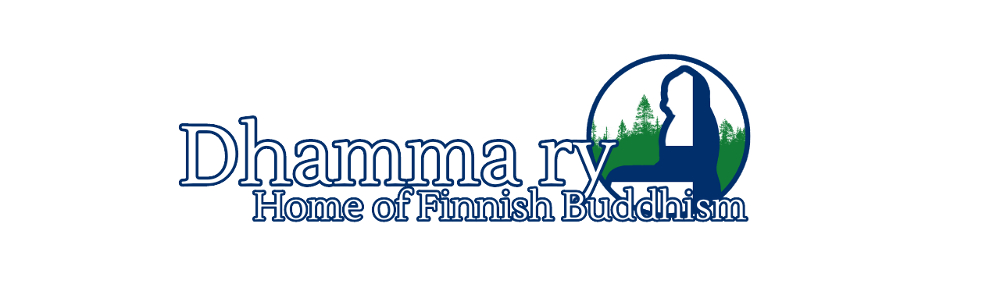

<figure>

  <figcaption>Kuva: <a href="https://readingfaithfully.org">ReadingFaithfully.org</a></figcaption>
</figure>

Welcome to the Finnish hub for Early Buddhism! 

Nordicbuddhism.fi is a website dedicated to the practice of meditation and the study of Early Buddhist Texts.

Whether you want to <a href="/categories/suttastudy">explore the Buddha's teachings</a>, <a href="/categories/monasticperspective">learn from experienced teachers</a>, or <a href="/categories/guidedmeditations">see how the teachings work on the cushion</a>, this is the place for you!

We publish articles on Early Buddhism and also share the teachings of experienced monastics.

Nordicbuddhism.fi is an English sister-site of <a href="https://meditoikuinbuddha.fi">Meditoikuinbuddha.fi</a>, where we study the Early Buddhist Texts in Finnish.

<a href="https://www.vecteezy.com/free-vector/lotus">Lotus Vectors by Vecteezy</a>

Nordicbuddhism.fi is run by <a href="https://dhamma.fi>Dhamma Society of Finland</a>, a newly found Buddhist society which aims to bring the Buddha's teachings come alive in Finland.

