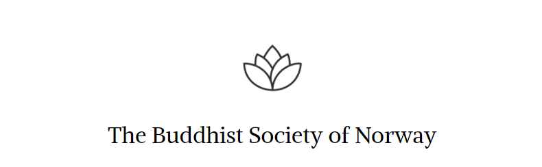

<figure>

  <figcaption>Kuva: <a href="https://readingfaithfully.org">ReadingFaithfully.org</a></figcaption>
</figure>

Welcome to the Finnish hub of Nordic Buddhism! 

Whether you want to explore the Buddha's teachings or read about <a href="/categories/announcements">what is happening in Finnish and Nordic Buddhism</a>, this is the place for you!

We publish articles on Early Buddhism and also share the teachings of experienced monastics.

Meditate like the Buddha is an English sister-site of <a href="https://meditoikuinbuddha.fi>Meditoikuinbuddha.fi</a>, where we study the Early Buddhist Texts in Finnish.

<a href="https://www.vecteezy.com/free-vector/lotus">Lotus Vectors by Vecteezy</a>

Meditatelikethebuddha.fi is co-operating with <a href="https://www.dnbf.org/en">The Buddhist Society of Norway</a>, which runs a local group in Tampere, Finland.

If you are interested in participating in our activities send an email to tampere@dnbf.org.

